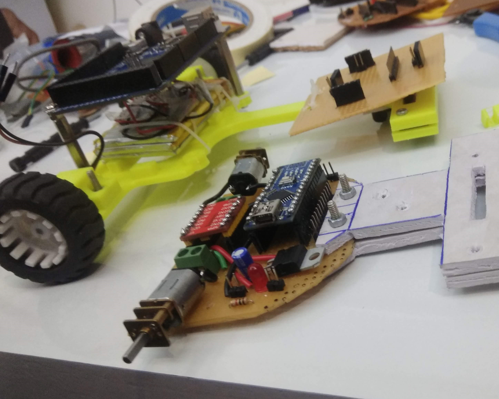

# Fast-Line-Follower

### Description
The line follower code was written for a national competition at IIT Kanpur. It consisted of QTR sensor along with a LCD display to show required information. I have image of the robot given below. It was a competition and I wasn't allowed to record the video but I have similar Line Following Robots showed in the video. The video consist of 3 to 4 robots.

[Youtube Link](https://youtu.be/Ekl4wVIpUEs)
